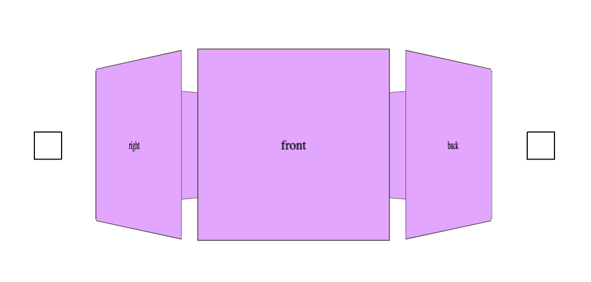

# Carrousel



## Installation
Ajoutez ce container dans votre html.   

```html
<div id="container-slider" class="container-slider">
  <button id="prev" class="prev btn">Prewiew</button>
  <div id="cube" class="cube">
    <div class="face"><div>Card || image || ...</div></div>
    <div class="face"><div>Card || image || ...</div></div>
    <div class="face"><div>Card || image || ...</div></div>
    <div class="face"><div>Card || image || ...</div></div>
  </div>
  <button id="next" class="next btn">Next</button>
</div>
````

Dans la div.cube se trouve les faces qui représentent les elements du carrousel.   
Vous pouvez ajouter d'autre face, pour celà il faudra ajouter `<div class="face"><div>Votre design</div></div>` et il faudra peut être ajuster la taille du container `class="container-slider"` en fonction du nombre de face que vous aurez introduit dans le carousel.   

---
Ajoutez le css à votre html.   
Vous pourrez ainsi l'adapter en fonction de votre propre design.

```css
* {
  margin: 0;
  padding: 0;
  box-sizing: border-box;
}
body {
  width: 100%;
  height: 100vh;
}
.container-slider {
  position: relative;
  max-width: 70%;
  height: 100%;
  perspective: 1000px;
  display: flex;
  justify-content: space-between;
  align-items: center;
  left: 50%;
  top: 50%;
  transform: translate(-50%, -50%);
}
.cube {
  --width-cube: 15rem;
  width: calc(var(--width-cube) + 2px);
  height: calc(var(--width-cube) + 2px);
  transform-style: preserve-3d;
}
.cube-prev {
  animation: spinPrev 3s ease-in-out forwards;
}
.cube-next {
  animation: spinNext 3s ease-in-out forwards;
}
.face {
  position: absolute;
  border: 1px solid #3e382c;
  width: var(--width-cube);
  height: var(--width-cube);
  text-align: center;
  line-height: var(--width-cube);
  background: rgb(218, 177, 254);
  transform-style: preserve-3d;
}
.face div {
  transform: translateZ(0.001px);
}
```
---
Ajoutez le dossier js avec les 2 fichiers js, puis d'éclarez ```<script type="module" src="./js/app.js"></script>``` dans votre html.

Pour ajusté l'espace entre les faces en cas de besoin. Ça se passe dans carousel.js ```const offsetFace = faces * 2.5;```   
En modifiant la valeur ```2.5```, vous obiendrez le changement voulu.

---
Maintenant à vous d'ajouté le design de chaque face pour votre utilisation, images, carte...N'hesitez pas à m'envoyé vos design sur la base de ce carrousel.